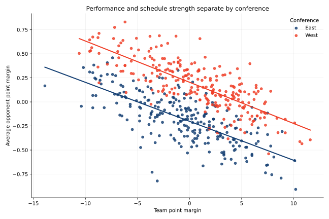
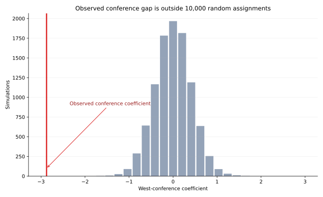
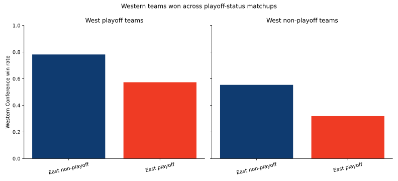

# Is the Western Conference Actually Better?

The conventional NBA view is that the Western Conference is stronger than the Eastern Conference. This project asks whether that reputation can be demonstrated with data, and whether the observed gap is too large to plausibly attribute to a random allocation of teams.

The analysis covers the 2005–2020 regular seasons, combining team standings, head-to-head records, playoff qualification, point margin, and opponent strength.

## Findings

- Western Conference teams won **55.7%** of interconference games.
- The West had a winning interconference record in **15 of 16 seasons**.
- Western playoff teams won 57% of their games against Eastern playoff teams; Western non-playoff teams won 55% against their Eastern counterparts.
- At the same .500 winning percentage, the playoff model estimated a much lower qualification probability for a Western team than an Eastern team.

## Schedule strength

The project measures schedule difficulty using opponents' average point margins, then compares that difficulty with team performance. This provides another way to test conference strength: if one conference consistently faces stronger opponents, raw win totals alone can understate the quality of its teams.



## Simulation model

A 10,000-run permutation model randomly allocated 15 teams to each conference within every season, refit the playoff model, and recorded the conference coefficient. None of the simulated coefficients was as extreme as the observed value—an empirical probability below 0.01%. The gap is therefore extremely unlikely under random conference allocation and is statistically distinguishable at conventional significance levels.



## Repository structure

```text
R/
  01_data_preparation.R
  02_conference_strength.R
  03_schedule_strength.R
  04_playoff_threshold_model.R
  05_permutation_test.R
data/
  combined_standings.csv
  combined_team_vs_team_records.csv
results/figures/
notebooks/
```

## Tools

R · tidyverse · ggplot2 · logistic regression · permutation testing · Plotly

## Playoff-status comparison

The overall interconference advantage also appears when teams are compared by playoff status, rather than allowing the strongest teams in one conference to dominate the comparison.


